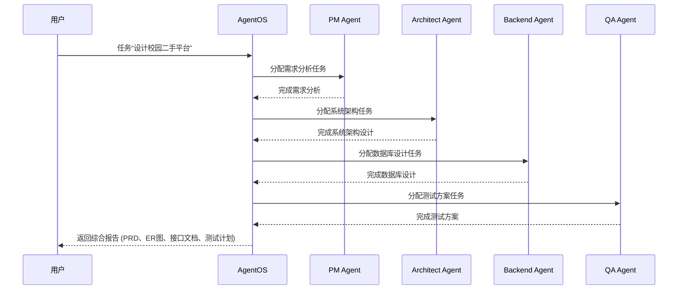
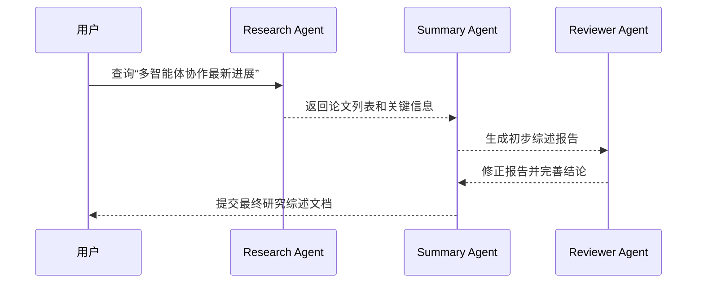
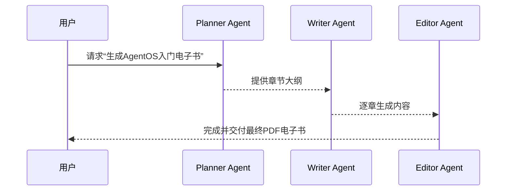
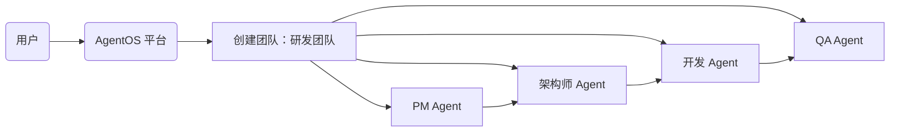

# AgentOS：多智能体协作操作系统平台

**执行摘要**：AgentOS 是一个面向多智能体团队协作的 AI 平台，致力于整合 LLM 智能体、工具调用、记忆管理和工作流编排。通过构建“Agent 注册中心、工具中心、记忆中心、A2A 通信总线、工作流引擎、调度器、观测模块”等核心组件，AgentOS 可让开发者像管理微服务一样管理智能体，支持任务拆解、多智能体协作和长期记忆。项目以 Vue3+SpringBoot+LangGraph 为基础，后端使用 PostgreSQL/Milvus/Neo4j 等持久化存储。AgentOS 最大亮点在于**Agent 团队协作**和**统一记忆管理**，旨在解决传统多智能体系统缺乏全局状态同步的问题。系统原型支持“研发团队任务分配”“论文综述生成”“电子书报告生成”等场景，将作为 2–3 个月毕业设计或实习项目的完整演示。参考资料如 LangChain 的 LLM Agent OS 论文、Dify 官方文档、Coze 平台说明等说明，AgentOS 结合了业界最佳实践，并通过差异化设计实现创新。

## 项目定位

当前市面上的 Agent 平台（如 Dify、Coze）主要提供**单智能体工作流**的可视化编排和 RAG 能力。然而，随着智能体数量和复杂度增加，多智能体系统在**协作与状态管理**方面面临重大挑战。研究指出，多智能体系统常因缺乏共享记忆而导致结果不一致或资源浪费。AgentOS 的定位是**低层级的多智能体操作系统**：它提供智能体生命周期管理、任务调度、记忆存储、跨智能体消息通信等基础设施，让用户关注业务逻辑本身。具体特点包括：  

- **多智能体团队**：用户创建“团队”，由多个角色智能体协作完成任务（如 PM、架构师、开发、测试）。团队间可共用记忆和任务结果，避免重复工作。  
- **统一记忆中心**：内置短期/长期对话历史、语义向量库（Milvus）、知识图谱（Neo4j）等多种记忆策略，确保各智能体共享一致状态。  
- **Agent 通信总线 (A2A)**：支持异步消息传递和事件订阅，智能体间可直接发送任务或结果，减少延迟和中间层依赖。  
- **可编程工作流**：基于 LangGraph 的低代码流程编排，可设计多智能体调用顺序、条件分支、循环等复杂逻辑。  
- **工具调用 (MCP) 集成**：内置检索、计算、GitHub 等工具，通过 MCP 统一接入，智能体可直接访问外部系统。  
- **观测与调度**：提供任务监控、Token/模型耗用统计、执行日志、链路追踪等运维能力，并支持定时任务自动运行。  

通过这些能力，AgentOS 能协同运行多个 LLM 智能体，提高系统效率和可维护性。正如研究所示，要使多智能体系统「像协调团队而非相互碰撞的独立进程」，必须加强记忆管理和任务调度。AgentOS 即参考此理念，努力成为面向未来企业级 Agent 的基础平台。

## 系统架构

AgentOS 采用 **前后端分离**架构：前端使用 Vue3/Element Plus 构建用户界面，后端采用 SpringBoot 提供 API 和权限管理，智能体运行时独立部署于 Python(LangGraph)。整体架构图如下：  

```mermaid
flowchart LR
    subgraph 前端(UI)
        UI[Vue3 + Element] 
    end
    subgraph 后端(Java)
        API[SpringBoot API]
        Auth[Spring Security]
        Scheduler[任务调度器]
        Observability[观测模块]
    end
    subgraph 智能体运行时(Python)
        LangGraph[LangGraph 工作流引擎]
        Agents[智能体执行器(Agent Executor)]
    end
    subgraph 存储层
        PG[(PostgreSQL)]
        Redis[(Redis)]
        Milvus[(Milvus 向量库)]
        Neo4j[(Neo4j 图数据库)]
    end

    UI --> API
    API --> Agents
    Agents --> PG
    Agents --> Redis
    Agents --> Milvus
    Agents --> Neo4j
    Agents -->|调用| API
    API -->|查询| PG
```

- **前端**：Vue3 + TypeScript + Element Plus，提供登录、Agent管理、流程设计、运行监控等界面。  
- **后端**：SpringBoot 3 框架负责用户/权限管理、REST API、任务调度和结果存储，使用 MyBatis Plus 访问 PostgreSQL。  
- **智能体运行时**：Python 构建，基于 LangChain/LangGraph。每个 Agent 在 LangGraph 中表示为节点，可串联形成多智能体工作流。  
- **持久化存储**：PostgreSQL 记录关系型数据（用户、Agent 定义、历史记录等）；Redis 用于短期对话缓存；Milvus 保存向量化记忆；Neo4j 存储知识图谱。  
- **工具接入**：采用 MCP 协议对接外部工具（搜索、GitHub、邮件等），后端维护 MCP 注册表。  
- **观测**：集成日志、指标和可视化组件，对任务执行链路进行监控和跟踪，支持通过 LangSmith 等工具进一步分析。

## 技术栈

- **前端**：Vue3, TypeScript, Pinia, Element Plus, ECharts（监控图表）。  
- **后端 (Java)**：SpringBoot 3, Spring Security, MyBatis Plus, PostgreSQL (12+), Redis。消息队列可选 RabbitMQ/Kafka。  
- **智能体 (Python)**：FastAPI, LangChain/LangGraph (多智能体工作流), PydanticAI (数据模型), OpenAI/Gemini SDK (LLM 接口)。  
- **存储**：PostgreSQL（关系数据库），Redis（缓存/工作记忆），Milvus（向量检索），Neo4j（知识图谱）。  
- **其他**：Docker Compose 或 Kubernetes 编排部署，LangSmith（调试/评估）。

## 系统模块

AgentOS 的核心模块及对应数据模型如下表所示：  

| **模块**        | **功能**                             | **关键数据表/字段**                 | **示例数据/说明**                           |
| -------------- | ------------------------------------ | ---------------------------------- | ------------------------------------------- |
| **Agent 注册中心** | 管理智能体配置与元数据                | `agent(id, name, description, system_prompt, avatar_url, status, create_time)` | 存储智能体名称、描述、系统提示词等。例如：<br>`{id:1, name:"ResearchAgent", description:"信息检索", system_prompt:"你是一名研究员", status:true}`。 |
| **工具中心 (Tool Center)** | 管理 MCP 服务与工具配置                | `mcp_server(id,name,endpoint,status)`,<br>`tool(id,name,schema,mcp_id,description)` | `mcp_server`存储外部工具服务的信息，例如GitHub或文件系统API。<br>`tool`记录具体工具及其调用Schema。<br>示例：<br>```json\n{ "id":1, "name":"SearchTool", "schema":{/* OpenAPI Schema */}, "mcp_id":1 }\n``` |
| **记忆中心 (Memory Center)** | 管理会话历史和长期记忆                | 可以采用多张表或外部存储：<br>`chat_history(id, user_id, agent_id, role, content, timestamp)`<br>`agent_memory(id, agent_id, memory_type, content, created_at)` | - `chat_history` 存短期对话记录。（Redis/DB）<br>- `agent_memory` 存长期知识点或经验片段。（PostgreSQL/Neo4j/Milvus）<br>如：`{agent_id:2, memory_type:"long_term", content:"某技术总结", created_at:"..."} `。 |
| **A2A 通信总线**     | 智能体间异步消息交换                | 无需数据库持久化（可使用消息队列或内存队列） | 通过消息格式实现智能体相互通信，如：<br>```json\n{\n  \"from\":\"ResearchAgent\",\n  \"to\":\"WriterAgent\",\n  \"taskId\":\"abc123\",\n  \"content\":\"请生成技术报告概要\"\n}\n``` |
| **工作流编排中心 (Workflow)** | 可视化/编程式智能体工作流设计与执行       | 工作流节点与连接关系可存入 JSON 或表结构 | 节点类型示例：Agent、LLM、Tool、条件、循环等。<br>用户通过拖拽创建图形化流程，后端解析为 LangGraph 图。 |
| **调度中心 (Scheduler)**    | 定时任务与自动任务触发               | `schedule(id, name, cron_expr, workflow_id, status, created_at)` | 存储定时任务配置。<br>示例：`{name:"每日日报", cron_expr:"0 8 * * *", workflow_id:5, status:true}`。 |
| **可观测中心 (Observability)** | 监控运行状况和日志                    | `task_log(id, task_id, agent_name, message, timestamp)`<br>`metrics(...)` | 存储任务执行日志和指标，可视化展示运行链路、Token消耗等。 |

### Agent 注册示例

用户通过界面或 API 创建 Agent 时，提交 JSON 定义，例如：  

```json
{
  "name": "Research Agent",
  "description": "负责信息检索和资料总结",
  "system_prompt": "你是一名知识研究员，请根据查询生成总结",
  "tools": ["SearchTool", "SummarizationTool"]
}
```

后端存入 `agent` 表。

### MCP (工具) 注册示例

配置外部服务时，可创建 MCP 服务与工具。例如：  

```sql
-- MCP 服务表
CREATE TABLE mcp_server (
  id SERIAL PRIMARY KEY,
  name VARCHAR(50) UNIQUE NOT NULL,
  endpoint VARCHAR(255) NOT NULL,
  status BOOLEAN DEFAULT TRUE
);
-- 示例 MCP 服务
INSERT INTO mcp_server (name, endpoint) VALUES ('GitHub MCP', 'http://localhost:8001/api');
```

```sql
-- 工具表
CREATE TABLE tool (
  id SERIAL PRIMARY KEY,
  name VARCHAR(50),
  mcp_id INTEGER REFERENCES mcp_server(id),
  schema JSONB,
  description TEXT
);
-- 示例工具
INSERT INTO tool (name, mcp_id, schema) VALUES
('IssueCreator', 1, '{...OpenAPI schema...}');
```

### A2A 消息格式

智能体间通过统一的 JSON 消息进行通信：  

```json
{
  "taskId": "20240601-0001",
  "from": "PlannerAgent",
  "to": "WriterAgent",
  "content": "请根据当前大纲编写第一章内容。"
}
```

### TaskResult 统一结构

每个任务的最终结果统一封装，包含任务 ID、结果类型和内容。例如：  

```json
{
  "taskId": "20240601-0001",
  "taskName": "电子书生成任务",
  "type": "FILE",
  "content": {
    "fileName": "AgentOS_使用指南.pdf",
    "fileUrl": "http://.../downloads/AgentOS_使用指南.pdf"
  }
}
```

类型 (`type`) 支持：`TEXT`、`MARKDOWN`、`JSON`、`FILE`、`IMAGE` 等。

## 核心业务流程与示例场景

### 场景一：软件研发团队任务

**背景**：用户需要“设计一个校园二手交易平台”。系统自动创建一个研发团队，包含 PM、架构师、后端、测试智能体。

1. 用户在界面输入任务：“设计校园二手交易平台”。  
2. **PM Agent** 接手任务，对需求进行拆解和分析，输出模块列表（用户、商品、订单、评价等）。  
3. **架构师 Agent** 根据需求和技术选型（SpringBoot、MySQL、Redis、MQ 等）设计系统架构并输出总体方案。  
4. **后端 Agent** 基于架构方案设计数据库 ER 图，并生成初步表结构与 API 列表。  
5. **测试 Agent** 根据需求编写测试计划（包括功能测试用例和性能测试方案）。  
6. 平台最后汇总输出：需求文档 (PRD)、ER 图、接口文档、测试报告等。用户可以下载查看。

下图展示了上述任务执行的智能体协作流程：  



### 场景二：论文研究与综述

**背景**：用户需要“总结多智能体协作最新研究进展”。

1. **Research Agent**：搜索相关论文（调用学术搜索工具），提取关键词和核心思路。  
2. **Summary Agent**：根据检索结果生成研究综述草稿，包括架构趋势、关键问题、方法比较等。  
3. **Reviewer Agent**：审校草稿内容，纠正错误并优化表达。  
4. 最终输出一篇中文技术报告，包括参考文献列表和结论。



### 场景三：电子书/技术报告生成

**背景**：用户想生成一本关于 AgentOS 的入门电子书。

1. **Planner Agent**：根据目标主题制定章节大纲（如基础概念、系统架构、使用教程等）。  
2. **Writer Agent**：逐章撰写内容，调用 ChatGPT 生成文本，并根据大纲组织章节。  
3. **Editor Agent**：审校并润色全文，确保逻辑连贯、术语一致。  
4. **输出**：导出为 PDF 文件或 Markdown 文档。



## 开发路线

项目计划按迭代开发，单人全职完成，周期约 **3 个月**。每个版本的功能与时间预估如下：

- **V1 (第1–4周)**：基础框架和界面搭建。实现 Agent 注册与执行机制、用户认证、基本对话（对话 UI）和任务发布功能，支持单智能体调用；完成数据库设计和日志存储。
- **V2 (第5–8周)**：集成外部工具和记忆。引入 MCP 机制，对接至少两个工具（如搜索、文件操作）；实现短期/长期记忆（Redis 缓存对话，PostgreSQL 保存聊天历史，Milvus 向量检索搭建索引）；支持简单 RAG（知识库查询）调用。
- **V3 (第9–12周)**：多智能体协作。实现 A2A 通信机制，支持创建智能体团队；多智能体任务执行引擎，能够按照工作流顺序依次调用不同智能体；增强安全（Access Manager）和并发控制；支持多任务并行调度。
- **V4 (第13–16周)**：可视化与监控。完善前端体验：拖拽式工作流编辑器（基于 LangGraph）、智能体关系可视化图表（AntV G6）、任务日志可视化；搭建调度界面（定时任务管理）；开发观测组件：任务监控面板、Token/模型消耗统计；集成 LangSmith 等进行链路追踪调试；测试优化和发布部署。

各版本结束后进行功能验收和集成测试，逐步扩充平台能力。

## 演示与最终呈现

**页面清单与交互流程**：

- **登录/仪表盘**：显示当前用户的 Agent 团队数、正在运行任务、系统消耗统计（Token 总量、在线智能体数）等。用户可以从这里快速导航到各功能模块。  
- **Agent 团队管理**：列出创建的团队，支持新建团队（配置智能体成员）、编辑成员配置。每个团队可关联一个多智能体工作流模板。  
- **流程设计 (Workflow 编辑)**：可视化拖拽式编辑界面，用户将 Agent、LLM、工具节点放置画布并连线，形成流程。双击节点可设置参数或 Prompt。点击运行后触发执行。  
- **团队工作区 (聊天/任务监控)**：用户以类似聊天的方式查看多智能体协作。每一步智能体的思考和回复都会在该界面实时流式显示。可切换“流程图”视图查看任务执行轨迹和各智能体执行状态。  
- **智能体关系图**：使用图形展示当前团队内智能体的协作关系和消息流向，如树状或网络图。动态显示智能体间调用顺序和依赖。  
- **记忆/知识库页**：展示共享记忆内容，如全局知识图谱、关键记忆片段、向量检索结果示例等。用户可搜索历史对话或查看知识节点。  
- **监控/日志页**：任务执行日志实时滚动；图表显示模型调用次数、Token 用量、任务耗时等指标。支持根据 Task ID 查看执行链路详情。  
- **配置/运维页**：查看/编辑 MCP 工具列表、智能体列表、定时任务配置；日志输出窗口供查看系统运行状态和错误。

*关键截图/可视化建议*：建议演示时展示团队任务执行的动态过程，比如智能体之间的消息和思考过程。可准备「执行链路图」「关系图示例」等静态示意图，如下图所示（这里为示意性 Mermaid 示例）：  



（注：实际演示应使用平台输出的流程图和数据可视化界面。）

## 可扩展方向与差异化亮点

AgentOS 与 Dify、Coze 等产品平台相比，具有以下差异化特点：

- **多智能体团队与共享记忆**：Dify/Coze 强调可视化工作流和单个“应用”构建；AgentOS 则首要支持多智能体合作，每个团队可**垂直分工**并共享状态。如文献所述，通过让不同角色智能体各司其职并使用统一记忆，可以显著提高效率。AgentOS 强调记忆工程，避免多智能体之间“各唱各调”的问题。  
- **开放框架 vs 垂直集成**：Dify/Coze 提供“一站式”服务，但系统封闭；AgentOS 聚焦于平台级别，可作为**定制化底座**使用，开发者可自行添加工具和模型。我们的设计类似于“Kubernetes for Agents”，注重任务调度、资源管理和系统可扩展性。  
- **丰富的记忆与知识图谱**：标准平台多以简单对话记忆为主；AgentOS 内置多层次记忆（Redis 缓存、PostgreSQL 日志、Milvus 向量、Neo4j 图谱）。这符合多智能体系统研究的建议：**共享内存是协同的关键**。  
- **轻量可定制**：AgentOS 架构模块化，适合部署在企业环境（支持私有化部署和自定义扩展）。与其相比，Dify 等云服务对中间件和后台管理较多，Coze 虽开源但更专注于 Low-Code 视觉开发。  
- **研究导向**：参考最新学术成果（如 LLM Agent OS、KAOS），AgentOS 在设计中主动探索如高效调度、访问控制等前沿问题，为未来扩展（如 AIOS/KAOS 提到的断点续传、多模态集成等功能）预留空间。

总之，AgentOS 不是简单复刻 Dify，而是创新性地聚焦多 Agent 协同与记忆管理，具备企业级扩展潜力。正如 Dify 官网所述，他们专注于“agentic workflows、RAG 管道、可观测性”；而 AgentOS 增加了深度的协作管理模块和记忆体系，以满足更复杂的业务需求。

## 简历/答辩要点

- **项目名称**：AgentOS（多智能体操作系统平台）。  
- **技术关键词**：多智能体（Multi-Agent）、LangGraph、多任务调度、向量检索 (Milvus)、图数据库 (Neo4j)、RAG、MCP 协议、SpringBoot/Vue3。  
- **核心亮点**：强调团队协作和统一记忆；设计并实现 Agent 注册、A2A 通信、任务调度和可视化监控；使用最新的 LangChain/LangGraph 技术。可提及引用了最近出版的 *LLM Agent Operating System* 论文和行业最佳实践。  
- **应用场景**：软件需求分析、研究报告撰写、自动化文档生成等，一套平台覆盖多种复杂流程。  
- **难点与创新**：解决多智能体状态一致性问题，实现了跨 Agent 的共享记忆中心；使用事件驱动的异步通信和链路跟踪；设计微服务化部署方案，具有较高工程化水平。  
- **成绩指标**：系统可执行自定义工作流、支持多轮多 Agent 协作；运行时记录详细日志和调度信息，可复现任务执行过程。在答辩中可演示实际案例生成结果以及监控图表。  

## 部署建议

- **环境**：推荐使用 Docker Compose 或 Kubernetes 部署。可将系统拆分为：SpringBoot 后端容器、Python LangGraph 容器、PostgreSQL 容器、Redis 容器、Milvus 容器、Neo4j 容器、前端静态文件容器等。  
- **最小可行部署**：在一台 4 核+8GB 服务器上启动所有服务，可用 `docker-compose.yml` 快速启动。也可使用云服务（如 AWS ECS/EKS、Azure AKS）托管数据库。部署时需配置网络访问和安全组，建议使用反向代理（如 Nginx）统一入口。  
- **示例清单**：数据库：PostgreSQL 12+；缓存：Redis 6+；向量库：Milvus 2.x；知识库：Neo4j 5.x；队列（选用）：RabbitMQ；前端：Node.js 构建静态文件；后端：OpenJDK 17；Python：3.9+。  
- **安全**：启用 Spring Security 登录；对外只暴露前端和必要的 API；敏感信息（API Key、数据库密码）使用环境变量管理。  

## 测试用例与验收标准

- **功能测试**：  
  - Agent 注册、编辑、删除功能正常；各模块接口返回正确结果。  
  - 单 Agent 执行：创建单一 Agent，发送任务并接收输出，确认上下文和记忆保存符合预期。  
  - 多 Agent 协作：按预设工作流顺序执行任务，检查每个 Agent 的执行结果与流程一致。  
  - 工具调用：在任务中调用外部工具（如搜索接口）返回有效结果。  
  - 定时任务：配置定时任务后，在设定时间触发执行并记录日志。  
- **性能测试**：  
  - 系统在**并发任务**下可稳定运行，监控中无异常错误日志。  
  - 对话/记忆查询延迟低（<500ms 响应），向量检索（Milvus）在百万级向量下检索时间可接受。  
- **可用性测试**：  
  - 前端界面交互流畅，工作流画布节点拖拽和连接正确。  
  - 日志及监控界面数据显示完整（任务链路、Token消耗等）。  
- **验收标准**：  
  - 三个示例场景（研发团队、论文综述、电子书）均能得到完整输出（如 PRD、报告、PDF 等）。  
  - 系统无致命 Bug，多轮运行后内存未明显泄漏。  
  - 文档齐全：README 中详细描述功能，演示过程中展示关键功能页面。  

## 演示脚本（约 5 分钟）

1. **0:00–0:30** — 登录系统，展示仪表盘（团队数、任务数、当前Token消耗图表）。  
2. **0:30–1:00** — 进入“Agent 团队管理”页面，新建一个“研发团队”，添加 PM、架构师、后端、测试四个智能体。  
3. **1:00–1:30** — 演示工作流设计页面：拖入“PM Agent”、“Architect Agent”、“Backend Agent”、“QA Agent”节点，连成串。保存流程。  
4. **1:30–2:00** — 切换至“工作区/对话”页面，输入任务 “设计校园二手交易平台”。启动流程，实况显示每个智能体的思考和回答。  
5. **2:00–2:30** — 流程执行完毕，展示最终输出（PRD、ER图、接口文档简要）。打开“任务监控”查看执行链路和日志。  
6. **2:30–3:00** — 演示“智能体关系图”：显示团队内智能体结构和调用顺序。  
7. **3:00–3:30** — 切换场景 “论文研究”：选择已有团队（或新团队），输入“多智能体系统综述”。展示 Research→Summary→Reviewer 过程及结果。  
8. **3:30–4:00** — 演示“记忆中心”：查询历史对话或知识图谱，展示多个智能体共享的记忆记录。  
9. **4:00–4:30** — 演示“监控/日志”页面：查看任务耗时统计和模型调用情况，说明系统可观测性功能。  
10. **4:30–5:00** — 总结：强调关键技术点（多智能体协作、LangGraph实现、共享记忆），回答评委提问。

以上即为 AgentOS 项目的概述、设计和实施细节，涵盖从架构到演示的完整准备。通过**多智能体团队协作**和**系统化记忆管理**的创新，AgentOS 为 AI Agent 的落地应用提供了坚实的平台基础。  

**参考资料**：LangChain 社区关于 Agent OS 的白皮书、Dify 官网、Coze 平台说明、O’Reilly 关于多智能体记忆的分析等。